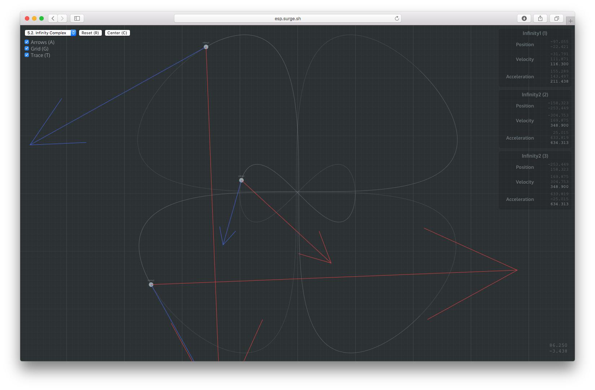

# Epita Space Program



This is a 2D visualization environment for a physics simulation. It was built as a companion visualization tool for a C# practical session given to [EPITA](https://www.epita.net)'s first year students. While the original subject's purpose is to teach C#, the visualization environment itself is language-agnostic and communicates with the student's application via WebSockets.

## Disclaimer

This application should not be taken as an example on how to build *good* React applications: compromises were made for performance reasons, and performances aren't great anyway. There is still much to be done in the realm of optimization, although I'm afraid much is lost to SVG's inherent limitations. Also, the source is missing a lot of type annotations.

## Building the project

```sh
yarn install
yarn start

// To build a production optimized bundle
yarn build
```

## Credits

This project was bootstrapped with [Create React App](https://github.com/facebookincubator/create-react-app).
